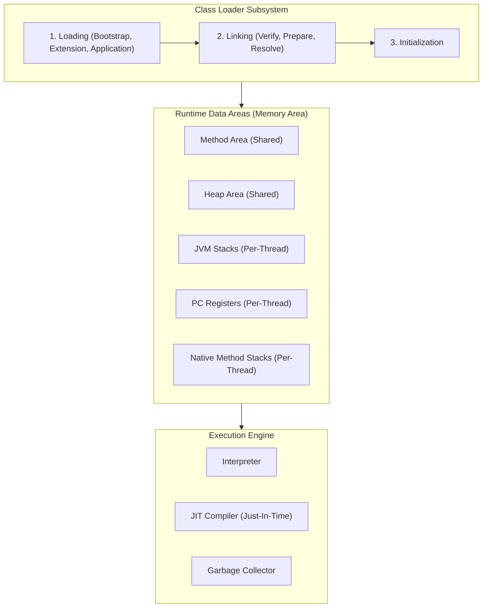

# JVM Internals & Architecture Report

This report explains the internals of the Java Virtual Machine (JVM), its memory model, execution engine, and the mechanics that enable the "Write Once, Run Anywhere" (WORA) philosophy.

---

## 1. JVM Architecture Overview

The JVM consists of three main subsystems:
1. **Class Loader Subsystem**
2. **Runtime Data Areas (Memory)**
3. **Execution Engine**

---

## 2. Class Loader Subsystem

The Class Loader subsystem is responsible for loading compiled `.class` files into memory. This occurs in three phases:

1. **Loading**: Class loaders locate and import the binary data representing the class. Java uses a **Delegation Hierarchy Model**:
   - **Bootstrap Class Loader**: Loads core Java libraries (from `rt.jar` / JDK modules).
   - **Platform (Extension) Class Loader**: Loads classes from extended Java directories.
   - **Application (System) Class Loader**: Loads application-specific classes from the classpath.
2. **Linking**: Prepares the class for execution:
   - **Verification**: Evaluates JVM instructions for security, format rules, and structural safety (prevents corrupt bytecodes).
   - **Preparation**: Allocates memory for static fields and initializes them to default values.
   - **Resolution**: Resolves symbolic references (names in constant pool) to actual direct memory references.
3. **Initialization**: Executes static initializers (`static { ... }` blocks) and assigns defined values to static variables.

---

## 3. Runtime Data Areas (JVM Memory Model)

Runtime Data Areas represent the memory allocated to the JVM when the process is executed.

| Memory Area | Shared/Per-Thread | Contents |
| :--- | :--- | :--- |
| **Method Area** | Shared | Class structures, metadata, constant pools, constructor codes, and static field values. |
| **Heap Area** | Shared | All instantiated objects and arrays. This is the main target area for Garbage Collection. |
| **JVM Stack** | Per-Thread | Stack frames containing local variables, partial results, and reference pointers for method invocations. |
| **PC Register** | Per-Thread | Contains the address of the JVM instruction currently being executed by the thread. |
| **Native Stack**| Per-Thread | Stack frames allocated for Native (C/C++) methods accessed via Java Native Interface (JNI). |

---

## 4. Execution Engine

The Execution Engine processes the bytecode loaded into the Runtime Data Areas. It contains three critical components:

### A. Interpreter
Reads JVM bytecode instructions one by one and executes them immediately. While quick to start, it is slow when executing loops or repetitive code blocks because it must re-interpret the same instructions repeatedly.

### B. JIT (Just-In-Time) Compiler
Improves execution performance significantly.
- **Profiling**: The JVM monitors execution to find "hot spots" (frequently executed methods or loops).
- **Compilation**: The JIT Compiler compiles those bytecode hotspots directly into native machine code.
- **Execution**: Future invocations of that hotspot bypass the interpreter and run native CPU instructions directly, offering execution speeds close to native C++ applications.

### C. Garbage Collector (GC)
A background daemon process that automatically manages memory lifecycle:
- Tracks reference graphs from roots (threads, static variables).
- Identifies unreferenced objects residing on the Heap.
- Reclaims that memory automatically, preventing memory leaks without manual developer intervention.

---

## 5. "Write Once, Run Anywhere" (WORA) Philosophy

The primary advantage of Java is its platform independence:

1. **Source to Bytecode**: The Java compiler (`javac`) compiles human-readable `.java` source files into a platform-agnostic intermediate language called **bytecode** (stored in `.class` files). Bytecode is the "machine code" of the virtual JVM.
2. **Platform-Specific JVM**: There is no "universal" JVM. Oracle, Adoptium, and others construct native JVMs specific to individual Operating Systems (e.g., JVM for macOS, JVM for Windows x64, JVM for Linux ARM64).
3. **Execution**: The compiler compiles once. The resulting bytecode is loaded on any machine. That platform's JVM translates the bytecode (via interpreter and JIT compiler) into the machine instructions native to that CPU architecture. Thus, the developer writes code once, compiles it to bytecode, and can execute it anywhere a compatible JVM is running.
